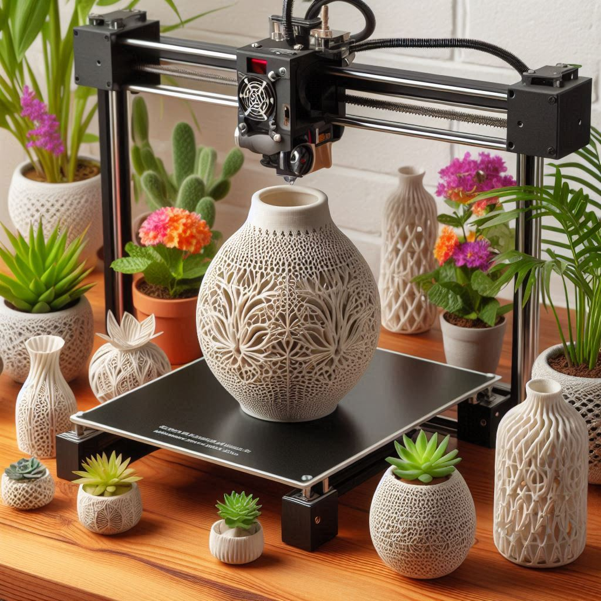

<a name="readme-top"></a>

<br />
<div align="center">
  <a href="https://github.com/AbimaelFranco/bioprint">
    
  </a>

  <h3 align="center">BioPrint</h3>

  <p align="center">
    BioPrint is a business that uses 3D printing technology and recycled materials to create custom furniture and decoration.
    
  </p>
</div>

## About The Project

BioPrint is not just another furniture and decoration company; it is a business founded on the principles of innovation and sustainability. By harnessing cutting-edge 3D printing technology and using recycled materials, we create custom-designed furniture that reflects both the personal style of our clients and our commitment to environmental responsibility.


### Built With

* [![Python][Python.js]][Python-url]
* [![Django][Django.js]][Django-url]

<!-- GETTING STARTED -->
## Getting Started

This section will guide you through the setup and usage of the "BioPrint" project. The project is developed using Python 3.12.3 and contains all necessary dependencies and scripts within the repository. You can access the repository at the following link: [BioPrint](https://github.com/AbimaelFranco/bioprint)

### Prerequisites

This is an list things you need to use BioPrint.
* [Python 3.12.3](https://www.python.org/downloads/)
* [Git](https://git-scm.com/downloads)

### Installation

1. Clone the Repository
   ```sh
   git clone https://github.com/AbimaelFranco/bioprint
   cd bioprint
   ```
2. Set Up the Virtual Environment
   ```sh
   python3 -m venv venv
   source venv/bin/activate  # On Windows, use `venv\Scripts\activate`
   ```
3. Install Dependencies
   ```sh
   pip install -r requirements.txt
   ```

### Usage

After successfully setting up the project, you can run the development server using the following command:

```sh
python manage.py runserver
```

Then, open your browser and navigate to http://127.0.0.1:8000/home to view the website. You will see the homepage where you can browse through the products, view the shop, and read about our sustainability efforts.


## PROJECT SCREENSHOTS


<!-- LICENSE -->
## License

Distributed under the GPL-3.0 license. See `LICENSE.txt` for more information.


[Python.js]: https://img.shields.io/badge/python-3670A0?style=for-the-badge&logo=python&logoColor=ffdd54
[Django.js]: https://img.shields.io/badge/Django-092E20?style=for-the-badge&logo=django&logoColor=green
[Django-url]: https://www.djangoproject.com/
[Python-url]: https://www.python.org/
